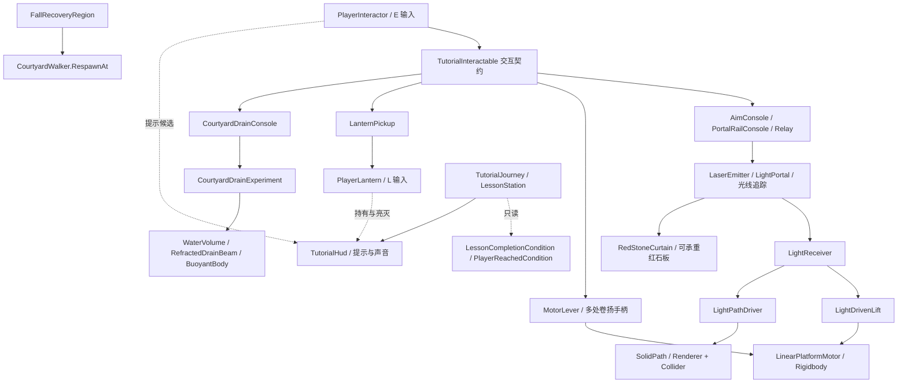

# 海岸原型 V9：可复用机关与玩家模块

本文记录代码职责、调用入口与编辑器迁移方式。三段玩法及编辑方法见 [关卡说明](CoastalV9Routes.md)；下面的模块能力不等于已经完成当前场景的全路线验收。

## 1. 组织原则与依赖

机关直接读取光照、接收命令并改变真实几何，不读取教学阶段、提示次数、奖励记录或提灯持有状态。玩家交互、提灯、教学观察、HUD、跌落恢复各自是可移除的组件。移除 `TutorialJourney` 和 `TutorialHud` 后，已经绑定的交互和机关仍可运行。

这里的“独立”指运行职责与调用入口分离，并非每个文件都有独立程序集。`TutorialInteractable` 与 `TutorialInteractionPolicy` 保留旧文件和命名空间，供通用交互复用；名称保留是为了兼容已有脚本与序列化。



`CoastalWalkthrough` 保留全景、观察点、Home 回初始出生点等场景级入口；排水状态和闸门运动已经归 `CourtyardDrainExperiment`。它不再作为每个机关的通用控制器。

## 2. 模块职责与公开入口

| 模块 | 负责 | 主要入口 / 配置 |
|---|---|---|
| `PlayerInteractor` | 玩家能否行动、真实交互距离、遮挡、最近候选、E 输入 | `CanInteract`、`Interact`、`TryInteract`、`RefreshNearby`；`walker`、`cameraRig`、`interactionOrigin`、`allowInteraction`、`interactionObstructions` |
| `TutorialInteractable` | 可交互对象的共同契约 | `Use(PlayerInteractor)`、`CanUse`、`Available`、`DisplayPrompt`、`useRadius`、`interactionPoint` |
| `PlayerLantern` | 提灯库存、照明与随身模型、L 输入、首次拾取事件 | `GiveLantern()`、`SetLantern(bool)`、`Toggle()`、`HasLantern`、`LanternOn`、`pickedUp` |
| `LinearPlatformMotor` | 沿已设路径移动现有 Rigidbody，任意位置停车 | `SetDirection(-1/0/1)`、`Simulate`、`NormalizedTravel`；`platformBody`、`bottom`、`top`、`positionsAreLocal`、`speed` |
| `LightDrivenLift` | 把两只受光器映射成同一台电机的正 / 反向 | `receiverRaise`、`receiverLower`，继承通用电机所有字段和入口 |
| `MotorLever` | 向共用电机发出正向 / 停 / 反向 / 停命令 | `Use`、`SetDirection`、`Direction`、`RefreshHandle`；`motor`、可选 `handle` |
| `SolidPath` | 同步切换明确指定的可见几何与承重碰撞 | `SetSolid(bool)`、`IsSolid`、`renderers[]`、`colliders[]` |
| `LightPathDriver` | 将实时受光状态映射为光桥存在状态 | `receiver`、`path`、`EvaluateNow()` |
| `RedStoneCurtain` | 受光消失的实体，可作为竖直幕片或水平承重板 | `Mode`、`PhysicalCollider`、`Visuals`、`IsOpen`、`RestorePending` |
| `AimConsole` / Relay | 改变实际发射器方向；异地手柄共用原控制台 | `Select(int)`、`Apply()`、`aimPoints[]`、`emitter` |
| `PortalRailConsole` / Relay | 在已设停靠点之间移动真实光门 | `Select(int)`、`Simulate(float)`、`docks[]`、`movingPortal`、`speed` |
| `CourtyardDrainExperiment` | 原水池实验的排水、重置、浮物恢复与闸门动画 | `StartDrain()`、`ResetExperiment()`、`Toggle()`、`Powered`、`SimulateGate(float)` |
| `FallRecoveryRegion` | 玩家进入指定低处区域时回本段安全点 | `walker`、`safePoint`、本地 `center/size`、`EvaluateNow()`、`RecoveryCount` |
| `TutorialJourney` | 观察已配置站点、提示递进、发布真实成功反馈 | `lessons[]`、`ShowObservation()`、`ObserveWorld()`、`NotifyReward(string)` |
| `TutorialHud` / `TutorialInput` | 可选 HUD / 声音，以及 H / C 输入 | HUD 的 `journey/interactor/lantern/chimeSource`；输入组件的 `journey/interactor/cameraRig` |
| `PlayerReachedCondition` | 只读玩家是否进入目标的局部盒范围 | `player`、`destination`、`halfExtents`；`IsComplete` |

`PlayerLantern` 命名空间为 `CoastalTemple.Player`，源文件放在 `Runtime/Interaction`，避免把旧的玩家数值测试项目强制耦合到教学程序集。

## 3. 独立调用示例

下列变量表示已经在编辑器绑定的组件。示例不补建环境，不要求教学组件存在。

```csharp
// 任意输入系统可用同一个交互入口；它内部检查距离、遮挡和行动许可。
interactor.readKeyboardInput = false;
bool accepted = interactor.Interact(console);

// 提灯持有状态独立；GiveLantern 返回是否首次获得。
bool newlyAcquired = playerLantern.GiveLantern();
playerLantern.SetLantern(false);
playerLantern.Toggle();

// 一台通用电机可以搬桥、升降墙体或移动光门的支座。
motor.SetDirection(1);
motor.SetDirection(0);   // 在当前位置停止，几何不会自动回到端点。
motor.SetDirection(-1);

// 两端的手柄引用同一 motor，不复制当前方向。
entryLever.motor = motor;
landingLever.motor = motor;
entryLever.Use(interactor);   // 开始正向。
landingLever.Use(interactor); // 从另一端停止同一台电机。

// 无光驱动器绑定时，也可由其他机制直接切换已有桥面。
path.SetSolid(true);

// 原水池实验无需玩家或教学对象。
experiment.StartDrain();
experiment.ResetExperiment();

// 外部恢复或存档系统可选择位置；不会覆盖初始出生点。
walker.RespawnAt(sectionEntrance.position, sectionEntrance.eulerAngles.y);
walker.ResetPosition(); // 仍回 Awake 记录的原始出生点，而非上次恢复点。
```

注意 `LightDrivenLift` 继承的手动命令与实时光命令共同参与方向计算。正反请求同时存在会停止；`StopManual()` 只清手动请求，不能关闭还在照射的光源。完全手动的卷扬使用 `LinearPlatformMotor` 即可。绑定了 `LightPathDriver` 的 `SolidPath` 会在光驱动器下一次评估时按真实光照更新，不应同时由另一系统争用它的存在状态。

## 4. 桥、移动墙和光路

### 移动物体

`LinearPlatformMotor` 操作一个作者配置的 Rigidbody，沿 `bottom → top` 的直线移动。变量名字沿用旧升降台，但可用于水平桥、竖直墙体、斜向平台和光门支座。`positionsAreLocal` 决定端点属于平台父坐标还是世界坐标；不能在运行时随意更换坐标基准。

Rigidbody 是现有碰撞根，初始化会将其设为运动学、关闭重力，并配置插值与连续推测碰撞；缺少 Rigidbody 时报告配置问题，不自动添加替代物。可配置反向运动的配重，但配重不是额外电机。运行时只有继承的一个 `FixedUpdate` 推进物理，适配器或手柄不要再次逐帧调用 `Simulate`，否则会重复推进。

`MotorLever` 的方向、提示及手柄姿态读取 `motor.Direction`；每台电机只共享区分两次停止的循环记忆。换另一个手柄、外部停车或到端点停车，不会使两个控制台各自从正向重新开始。手柄只发命令，不推进物理。

### 光桥和红石支撑

`SolidPath` 同步控制指定 `Renderer[]` 和 `Collider[]`，因此桥面出现与承重一起变化。不要把支撑受光器自身、旁边固定地面或无关机关加入这些数组。

`LightPathDriver` 在光路评估之后读取受光器：必须启用、达到激活条件且当前仍受光。光移走或受光器停用后，旧的宽限或锁存状态不会继续维持光桥。关闭驱动器会移除它绑定的桥；`SolidPath` 被单独停用时也会清除该桥的可见与碰撞状态。

`RedStoneCurtain` 使用同一套光学规则，可把 `PhysicalCollider` 和模型水平放置成可承重红石板。`Permanent` 满足持续照射后保留开口；`WhileIlluminated` 随光显隐并遵守自身恢复宽限。恢复位置被角色 / 刚体占据时暂缓生成实体，避免把人夹入新出现的石板。两种模式应使用清楚不同的构造与反馈，不能仅靠同一红色外观要求玩家猜测差异。

`LightPortal` 只传递光线，不传送角色。移动光门改变真实出射位置与方向，沿途实体可遮挡。给光门增加移动支座时，应让一个电机负责一个 Transform 的位置；光门轨道和支座若需要两个自由度，使用明确父子层级，不让两个控制器同时覆盖同一世界姿态。

## 5. 教学、奖励和有限失败

`LessonStation` 可配置任意数量，包含 `name/title/safetyNote/marker/radius/hints[]`、可选 `completionCondition`、`completionMessage`、`onCompleted`。`safetyNote` 在当前站点的 HUD 中常驻显示，不需要按 H 才能看到。玩家位于多个半径内时选择最近站点；离开所有半径后没有当前站点。提示逐条递进，最后一条之后保持该条。

`LessonCompletionCondition` 是只读适配器；当前的 `PlayerReachedCondition` 使用 `destination.InverseTransformPoint(player.position)` 检查局部盒，默认半尺寸 `(3, 2, 3)`，包含边界并尊重目标旋转与缩放。未绑定玩家或目标时返回 false。进入范围可以发一次到达反馈，但不改变电机、桥、光线或交互许可。需要其他世界条件时添加相同契约的只读条件；也可把实际成功事件接到 `NotifyReward(string)`。

```csharp
journey.lessons = new[]
{
    new LessonStation
    {
        name = "workshop",
        title = "断阶工坊",
        marker = observationMarker,
        radius = 15,
        hints = new[] { "先看台面能够停在哪些高度。", "中层侧廊可以操作另一台卷扬。" },
        completionCondition = authoredArrivalCondition,
        completionMessage = "抵达上层通路"
    }
};
```

`TutorialHud` 负责显示和排队播放提示音，音源由编辑器绑定。提灯拾取通过 `pickedUp` 事件发布反馈。提示级数、奖励去重和站点完成记录都不参与机关解锁。`NotifyReward` 是事件通知入口，调用者负责保证它来自真实成功。

### 跌落恢复与玩家可见说明

在每段真实断口下方放置 `FallRecoveryRegion`，绑定该段入口的稳定 `safePoint`。`center/size` 是区域 Transform 的本地盒，支持旋转与缩放；检测玩家脚部位置，不依赖触发 Collider。每帧 `LateUpdate` 检查没有逐帧分配，也不依赖 TutorialJourney、HUD 或自动弹窗。

恢复只调用 `CourtyardWalker.RespawnAt`，清除竖直 / 水平速度、游泳状态、旧移动平台接触、俯仰，并恢复角色正常踏步高度。它不改变初始出生点、不重新加载场景、不重置桥的位置、已消散的永久石片、光门高度、排水或提灯。

每次进入区域最多恢复一次，离开后才允许下一次触发。即使安全点误放在盒内，也不会每帧反复传送；正确配置仍应让安全点处于区域外、位于稳定地面，并避免落入其他恢复盒。区域、角色组件或 CharacterController 停用时不恢复。组件不存在时完全不介入行走。

角色原有世界高度低于 `-12` 的回初始点保护仍在，区域必须放在玩家到达该高度之前能进入的位置；区域不能覆盖本来允许游泳探索的整片海湾。

**入口和恢复点应有可见、常驻的简短说明：**

> 失足会返回本段入口，机关保留当前状态。

这句话应由关卡中的提示牌或已配置的固定界面显示，不能只藏在本文件，也不应迫使玩家打开 H 提示才能知道。恢复点朝向应面向重新尝试的通路。各段布局与实际提示牌位置由关卡作者记录在后续关卡说明中。

## 6. 旧场景和显式迁移

保留现有 `.cs.meta` GUID。`TutorialInteractable` 类名 / 文件仍在原处，只有使用入口从 `Use(TutorialJourney)` 改为 `Use(PlayerInteractor)`；现有 Aim / Portal / Relay / Mirage / Drain / Lantern 控制台均使用新入口。

`TutorialJourney` 保留旧 `walker/cameraRig/handLight/carriedLantern/stations` 和原机关字段作为序列化迁移输入；旧 `Interact/TryInteract/CanInteract/GiveLantern/SetLantern` 只委派给明确绑定的新模块。它不在 Awake 自动创建组件或环境。旧代码能够编译，不意味着未迁移场景已完成绑定，也不意味着假定原四站路线的 V8 验收脚本适用于 V9。

`LightDrivenLift` 保持原脚本身份与字段名，通用运动字段移动到 `LinearPlatformMotor` 基类；同一组件仍可序列化这些继承字段。不要在旧光升降台旁再增加第二个电机来“兼容”，那会让两个更新同时移动平台。实际保存场景 / prefab 的引用仍需重开检查。

在 **非 Play 模式**显式调用并保存：

```csharp
// 玩家、提灯、HUD、输入模块绑定。旧字段已在原 authoring 中填写之后执行。
CoastalTemple.Tutorial.Editor.TutorialModuleMigration.Bind(journey);

// 原水池对象原地迁移；复用旧引用并绑定关联排水控制台。
CoastalTemple.Editor.CourtyardDrainMigration.Migrate(walkthrough);
```

对应菜单：

- **Coastal Temple → Tutorial → Bind Independent Player Modules**
- **Coastal Temple → Migrate Existing Drain Experiment**

第一项绑定独立玩家组件、HUD、音源和提灯事件；站点文本与 `journey.lessons` 由作者配置，不自动沿用旧四阶段硬编码。第二项创建 / 复用 `CourtyardDrainExperiment`，从旧 walkthrough 字段复制缺失引用，连接同场景关联 `CourtyardDrainConsole`；已经配置的新引用不被覆盖。`CoastalWalkthrough.ResetWater()` 保留为向实验组件的兼容委派。

这些迁移与关卡重建分别处理：只想保留旧布局并升级模块时无需重建整个关卡。地形挖空、桥墙模型、控制台摆位等由编辑器 authoring 工具负责，不是玩家或教学组件在 Awake 中补建。

旧 `TutorialSceneAuthoring` V8 recipe 已从菜单退役，仅保留历史源码；当前显式重建使用 `TutorialV9Authoring`，其玩家、旧教学根和地理根查找限定在活动场景内。

## 7. 验证入口和当前边界

独立行为检查：

```powershell
dotnet run --project Tools/Gameplay/InteractionChecks/InteractionChecks.csproj
dotnet run --project Tools/Gameplay/LeverChecks/LeverChecks.csproj
dotnet run --project Tools/Gameplay/MechanismChecks/MechanismChecks.csproj
dotnet run --project Tools/Gameplay/PlayerMotionChecks/PlayerMotionChecks.csproj
dotnet build Tools/Gameplay/InteractionCompile/InteractionCompile.csproj
```

本模块修改已运行：Interaction 20 项、Lever / Arrival 20 项、Mechanism 35 项、Player / Lift / Recovery 43 项通过；完整离线 Runtime 与相关检查编译零错误、零警告。Lever 检查使用真实组件源码与最小托管 Unity 宿主，不把该结果当成真实物理测试。恢复新增检查先得到 34 项通过、2 项预期缺特性失败，再实现到 43 项通过。

Unity 中的组件检查入口（各项单独执行并保存结果）：

```csharp
// Edit 模式：临时组件 / 预览场景检查。
CoastalTemple.Tutorial.Editor.TutorialInteractionChecks.Run();
CoastalTemple.Editor.CourtyardDrainExperimentChecks.Run();
CoastalTemple.Mechanisms.LightDrivenLiftChecks.Run();

// 必须进入 Play 模式：Unity 的独立 LocalPhysicsMode 场景创建需要运行时。
CoastalTemple.Mechanisms.MechanismComponentChecks.Run();
CoastalTemple.Player.FallRecoveryChecks.Run();
```

新增恢复组件检查覆盖真实角色移动状态清零、旋转 / 缩放区域、停用、重复进入、误放安全点不抖动，以及 `ResetPosition` 仍回原始出生点。它在 Play 模式激活已配置的临时根对象，让真实 `Awake` 初始化角色；仅接触 / 游泳保留状态使用测试注入，以单独检查恢复契约。两个独立物理场景检查在结束时立即移除临时对象，再通过 `UnloadSceneAsync` 卸载场景。它们不替代在实际水中跌落、移动墙乘坐和完整往返路线的 Play 模式验收。场景负责人应按各入口要求分别在 Edit / Play 模式执行并记录结果，不能由离线编译推定通过。

最终已另行执行上述 Unity 组件入口、连续主路线与局部恢复，以及实际水面游泳和摄像机检查。结果和人工试玩边界见 [V9 验收记录](CoastalV9Verification/README.md)；连续主线使用正常交互策略、真实角色与机关运动，未传送角色跳关。
